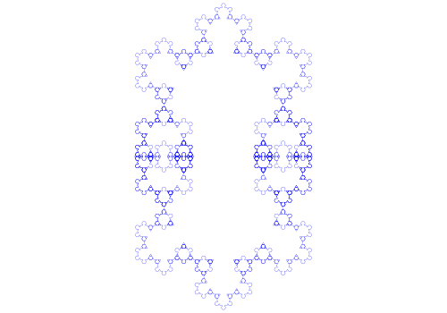

# ❄️ Flocon de Koch — Générateur de Fractales en C++

Générateur générique de fractales de type Koch, avec export SVG et parallélisation OpenMP.

---

## Aperçu

Ce projet implémente un générateur de fractales de Koch en C++ moderne (C++20). Il permet de produire des courbes fractales paramétrables — polygone de base, ordre du polygone secondaire, profondeur — et de les exporter au format SVG.

| Paramètre | Description |
|-----------|-------------|
| `initial_segment_number` | Nombre de côtés du polygone de base (1 = segment, 3 = triangle, 6 = hexagone…) |
| `new_element_order` | Ordre du polygone inséré à chaque itération |
| `fractal_order` | Profondeur de récursion |
| `radius` | Rayon initial |
| `factor` | Facteur de division des segments (1/3 pour le flocon classique) |

---

## Exemples de fractales générées

<p align="center"></p>
<p align="center"><b>Figure 1</b> — Polygone de base : 2, polygone secondaire : 3, ordre : 7</p>
<p align="center"></p>
<p align="center"><b>Figure 2</b> — Polygone de base : 2, polygone secondaire : 6, ordre : 4</p>
<p align="center"></p>
<p align="center"><b>Figure 3</b> — Polygone de base : 1, polygone secondaire : 3, ordre : 7</p>

---

## Propriétés mathématiques

Le nombre de segments après $P$ itérations est donné par :

$$N = K \cdot (O + 1)^P$$

où $K$ est le nombre de segments initiaux et $O$ l'ordre du polygone secondaire.

Le nombre de points est $Q = N + 1$ (premier et dernier points confondus pour une courbe fermée).

À chaque itération, le saut dans le tableau de points vaut $K \cdot (O + 1)^{P - D}$, avec $D$ la profondeur courante.

La position de chaque nouveau point est calculée récursivement par :

$$P_{n+1} = P_n + R(\theta) \cdot (P_{n-1} - P_n)$$

où $\theta$ est l'angle extérieur du polygone central.

---

### Classes principales

**`point<T>`** — Vecteur 2D avec opérateurs arithmétiques surchargés (`+`, `-`, `*` scalaire). Passage par référence constante pour éviter les copies inutiles.

**`rotator`** — Calcule et met en cache $\cos(\theta)$ et $\sin(\theta)$ pour toute la durée de l'exécution. La rotation est appliquée via une fonction `inline`.

**`koch_fractal`** — Orchestre la construction de la courbe :
- `create_initial_curve()` — initialise le polygone de base
- `fractalize_segment()` — subdivise un segment selon la règle de Koch
- `compute()` — itère sur toutes les profondeurs avec parallélisation OpenMP
- `generate_svg()` — exporte le résultat en SVG

### Parallélisme

La structure fractale est *embarrassingly parallel* : chaque segment à un niveau donné peut être traité indépendamment. La directive `#pragma omp parallel for` est utilisée dans la boucle principale sans risque de *data race*, les zones mémoire de chaque thread étant disjointes.

### Calcul de la puissance entière

La fonction `fast_power()` implémente l'exponentiation rapide (*fast exponentiation*) en $O(\log n)$, utilisée pour calculer le nombre total de segments.

---

## Compilation

```bash
g++ code.cpp -fopenmp -o code -std=c++20
```

| Option | Rôle |
|--------|------|
| `-fopenmp` | Active la parallélisation OpenMP |
| `-std=c++20` | Requis pour `std::format` |

---

## Utilisation

```cpp
// Dans main()
koch_fractal frac(
    1,       // nombre de segments initiaux (triangle = 3, segment = 1…)
    3,       // ordre du polygone secondaire
    7,       // profondeur de récursion
    200.0,   // rayon initial
    1.0/3    // facteur de division (1/3 = flocon classique)
);

frac.compute();

fstream file("out.svg", ios_base::out);
frac.generate_svg(file);
```

Le fichier `out.svg` est généré dans le répertoire courant.

---
 
## Environnement de test
 
| Propriété | Valeur |
|-----------|--------|
| **CPU** | AMD Athlon Silver 3050U with Radeon Graphics |
| **Architecture** | x86_64 (32-bit, 64-bit) |
| **Cœurs / Threads** | 2 cœurs, 1 thread par cœur |
| **Fréquence** | 1400 MHz – 2300 MHz (boost activé) |
| **L1d / L1i** | 64 KiB / 128 KiB |
| **L2 / L3** | 1 MiB / 4 MiB |
| **Virtualisation** | AMD-V |
| **Extensions SIMD** | SSE4.1, SSE4.2, AVX, AVX2, FMA, AES |
 
---

## Performance

Le programme mesure le temps d'exécution moyen et l'écart-type sur plusieurs passes avec les paramètres suivants:

| Propriété | Valeur |
|-----------|--------|
| **Nombre de segments initiaux** | 2 |
| **Ordre du polygone secondaire** | 7 |
| **Profondeur de récursion** | 5 |

```
Sans OpenMP:
Le temps d'exécution moyen:              2.76815 millisecondes
La variation standard du temps d'exécution:  0.0260535 millisecondes
Avec OpenMP:
Le temps d'exécution moyen:              1.45342 millisecondes
La variation standard du temps d'exécution:  0.469416 millisecondes
```

---

## Pistes d'amélioration

- Allocation statique du buffer SVG pour éviter les appels à l'allocateur dynamique
- Formatage des coordonnées à largeur fixe pour réduire la taille des fichiers
- Export dans d'autres formats (PNG via Cairo, WebGL…)
- Réduction de l'accumulation d'erreurs numériques pour les polygones d'ordre élevé

---

## Dépendances

- Compilateur C++20 (`g++` ≥ 10 ou `clang++` ≥ 13)
- OpenMP (inclus avec GCC par défaut)
- Bibliothèque standard C++ (`<format>`, `<vector>`, `<cmath>`, `<fstream>`, `<chrono>`)

---

## Licence

Ce projet est distribué sous licence GNU GENERAL PUBLIC LICENSE. Voir le fichier `LICENSE` pour les détails.
